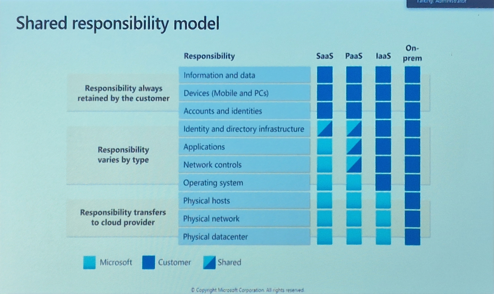

# 1 - Cloud Concepts
*25%-30%*

**Cloud Computing** is the delivery of computing services over the *internet* enabling faster innovation, flexible resources, and economies of scale.
- It is easier to upgrade hardware, because you are no longer required to wait until the hardware you already have bought served it's life sentence. 
- You share certain costs with other tennents using the same cloud computing solution, which keeps the costs low(er).

### Types of Cloud Solutions
- **Private Cloud** is a cloud solution used for a specific organisation. 
  - No *Capital Expenditures* to scale up.
  - Applications can be quickly provisioned and deprovisioned.
  - Organisations only pay for what they use.
- **Public Cloud** is a cloud solution owned by a cloud services or hosting provider. Provices resources and services to multiple organizations and users. Accessed via secure network connection (usually the internet).
  - Hardware must be purchased for start-up and maintenance.
  - Organisions have complete control over resources and security.
  - Organisations are responsible for hardware mainenance and updates.
- **Hybrid Cloud** combines *public* and *private* cloud to allow applications to run in the most appropriate location.
  - Provides the most flexibility.
  - Organisations determine where to run their applications.
  - Organisations control security, compliance, and legal requirements.
- **Multi Cloud** a company makes use of two or more different cloud providers.

### Types of Expenditures
- **Capital Expenditure** *(CapEx)*
  - The up-front spending of money on physical infrastructure
  - Costs from CapEx have a value that reduces over time.
- **Operational Expenditure** *(OpEx)*
  - Spend on products and services as needed, pay-as-you-go
  - Get billed immediatly

### Consumption-based model
Cloud service providers operate on a consumption-based model, which means that end users only pay for the resources that they use. Whatever they use is what they pay for
- Better cost prediction
- Prices for individual resources and services are provided
- Billing is based on actual usage

### Cloud Benefits
- *High availability* 
- *Scalability* You can scale-out or scale-in based on need (horizonal scaling). Add or remove a virtual machine/resource/node with the same services (identical copy). You would always need a load-balance to reach these nodes.
- *Predictability* There aren't any surprise costs.
- *Governance* Easier to institute access management and other policies
- *Elasticity* You can scale-up or scale-out based on need (vertical scaling). Upgrade or downgrade the computing powers of a machine. This will require a reboot of the machine! 
- *Reliability* The abilty of a system to recover from failures and continue to function.
- *Security*
- *Manageability* A lot of options to automate ops.

### Cloud Service Types

- **IaaS** - *Infrastructure as a Service*
  - Built pay-as-you-ho IT infrastructure by renting servers, virtual machines, storage, networks and operating systems form a cloud provider. 
    - The most flexible cloud serice.
    - You configure and manage the hardware for your application
  - Cloud provider is responsible for the:
    - **Physical building**
    - **Networking, firewalls/security**
    - **Servers and storage**

- **PaaS** - *Platform  as a Service*
  - Provides environment for building, testing, and developing software applications; without focusing on managing underlying infrastructure
    - Focus on application development.
    - Platform management is handled by the cloud provider.
  - Cloud provider is responsible for the:
    - Physical building
    - Networking, firewalls/security
    - Servers and storage
    - **Operating system**
    - **Development tools, database management, business analytics**

- **SaaS** - *Software  as a Service*
  - Users connect to and use cloud-based apps over the internet: for example , Microsoft Office, E-mail and Calandars.
    - Pay-as-you-go pricing model.
    - Users pay for the software they use on a subscription model.
  - Cloud provider is responsible for the:
    - Physical building
    - Networking, firewalls/security
    - Servers and storage
    - Operating system
    - Development tools, database management, business analytics
    - **Hosted applications/apps**

