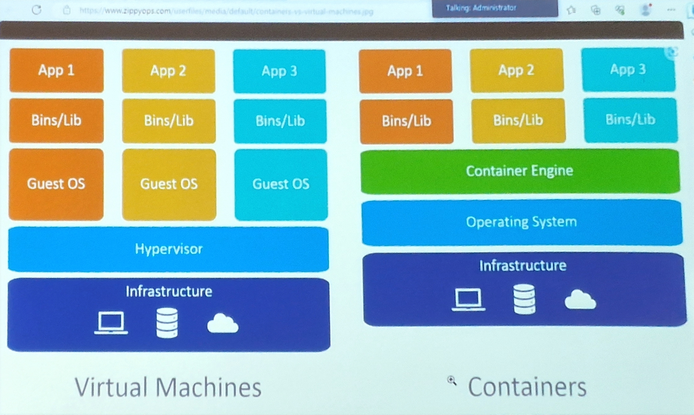

# 2 - Azure Achitecture and Services
[MS Learn](https://learn.microsoft.com/en-us/training/paths/azure-fundamentals-describe-azure-architecture-services/)
*35%-40%*

*FYI Azure Active Directory = Entra ID*
*Directory is the same as a tennant, used interchangable*

### Azure Accounts
- Azure account 
- Azure free account > You need a credit card to register. :cry: (12 months , 200 dollar credits for 30 days)
- Azure free student account > Is not really a thing anymore, just for a few courses. (95 Euro)
- Microsoft Learn sandbox

## Azure Architectural Components

### Physical locations
#### Regions
*Note: pricing is region based!*
- Regions are made up of one or more datacenters in close proximity.
  -  Provide flexibility and scale to reduce customer latency.
  - Preserve data residency with a comprehensive compliance offering

- **Azure Sovereign Regions** There are specialist Regions, with special rules for access
  - *Azure Sovereign Regions (US Goverment Services)*
      - US DoD > Specifically for Department of Defense
      - US Gov XX > Specifically for specific states
    -  Meets the security and compliance needs of the US federal agencies, state and local governments, and their solutions.
      - Seperate instance of Azure
      - Physically isolated from non-US government deployment
      - Accessible only to screened authorised personnel
  - *Azure Sovereign Regions (China)*
    - Microsoft is China's first foreign public cloud service provider, in compliance with government regulations.
        - China > 51% ownership is with a Chinese compagny
      - Physically seperated instance of Azure cloud services operated by 21Vianet
      - All data stays within China to ensure compliance

- **Region Pairs** two regions that are used to spread resources for safety/security.
  - At least 300 miles of seperation between region pairs
  - Automatic replication for some services
  - Prioritized region recovery in the event of outage
  - Updates are rollouts srquentially to minimize downtime

#### Availabiltiy zones
- Zone is a physical location with a region (although unknown to users which one).
  - Provides protection against downtime due to datacenter failure.
  - Physically seperate datacenters within the same region.
  - Each datacenter is equipped with independent power, cooling, and networking.
  - Connected through pricate fiber-optic networks.
- In each zone/datacenter there are multiple racks/fault domains.

#### Fault domain
- A fault domain is a rack in a datacenter.

### Hierarchy in Azure
- Directory/Tennant
  - Management Group
  -   Subsription
    -   Resource Group
      -   Resource

#### Management Groups
- Management groups can include multiple Azure subscriptions.
- Subscriptions inherit conditions applied to management groups.
- 10.000 management groups can be supported in a single directory.
- A management group tree can support up to six levels of depth.

#### Subscriptions
An Azure subscription provides you with authenticated and authorised access to Azure Accounts.
- **Billing Boundary** generate seprate billing reports and invoices for each subscription
- **Access Control Boundary** manage and control access to the resources that users can provision with specific subscriptions
- Reasons to use seperate subscriptions:
  - There is a cap on how many resources you can add to a specific subscription.
  - Seperate billing or access.

#### Resource Groups
- A resource group is a container to manage and aggregate resources in a single unit.
  - Resources can exist in only one resource
  - Resources can exist in different regions
  - Resources can be moved to different resource groups
  - Applications can utilize multiple resource 
  - Resource groups are free
- There is two ways in which you could use resource groups.
  - Similar resources types in a resource group. This might be the choice for bigger organisations with specialist people for specific resource types, so you can granulate access.
  - Based on usage, resources that serve the same 'project' are grouped. Can be easier to manage/delete resources based on their use case. Can be used if a (service)team has full stack responsibility
- Things to be aware of:
  - Resourcegroups can't be renamed. You will need to rebuilt the resources in a new group and delete the existing group.
  - Take note in which region your resources are 'built'. Most often the default is the same as the resource group, but not always.

#### Tags
- Use case: So you can know who is the owner of a resource
- You can enforce the use of specific tags with the use of policies.

## Compute
### Compute Types
Azure compute is an on-demand computing service that provdes computing resources such as disks, processors, memory, networking, and operating systems.
- **Virtual Machines** are software emulations of physical computers.
  - Includes virtual processor, memory, storage and networking
  - *IaaS* offering that provides total control and customisation.
- **App Services** is a fully managed platform to build, deploy and scale web apps and APIs quickly
  - Works with .Net, .NEt Core, Node .js, Java, Pyhton, or php
  - Paas offering with enterprise-grade performance, security , and compliance requirements
- *Container Services* are a light-weight, virtualised environment that does not require operating system managment, and can respond on changes on demand.
  - **Azure Container Instances** a *PaaS* offering that runs a container or pod of containers in Azure.
  - **Azure Container Apps** a *PaaS* offering like container instances that can load balance and scale.
  - **Azure Kubernetes Service** an orchestration service for containers with distributed architecture and large volumes of containers.
- **Azure Virtual Desktop** is a desktop and app virtualisation that runs in the cloud
  - Create a full desktop virtualisation environment without having to run additional gateway servers.
  - Reduce risk of resources being left behing
  - True multi-session deployments

### Comparing Azure Compute Options
- **Virtual machines**
  - Cloud based server that supports either Windows or Linux environments.
  - Useful for lift-and-shift migrations to the cloud.
  - Complete operating system packafe including host operating system
- **Virtual desktop**
  - Provides a cloud based personal computer Windows desktop experience.
  - Dedicated applications to connect and use, or accessible from any modern browser.
  - Multi-client login allows multiple users to log into the same machine at the same time
- **Containers**
  - Lightweight, miniature environment well suited for running microservices.
  - Designed for scalability and resiliency through orchestration.
  - Applications and services are packaged in a container that sits on-top of the host operating system. Multiple containers can sit on one host OS.

#### VM Config options
- **VM Availability** sets is a combination of the fault domain and the update domain.
    - Fault domain: where in the datacenter/zone, which rack.
    - Update domain: when the updates take place. You can have a maximum of 20 update domains.
  - You can add two or more VM's in an availability sets to ensure that at least one is available during planned or unplanned maintenance events.
- **Security** who is allowed to log on.
- **VM Size** 
  - vCPU:
  - RAM:
  - Data disks: 
  - Max IOPS: put through
  - Temp storage (GiB): Swap disk
  - Premium disk: Is SSD supported 
- **Run with Azure Spot discount** you will run a system for a discounted price, but if there is someone willing to pay full price, then you loose your instance. (There is an option in which the hard disks will be saved after decommissioning)
- OS Disk optioms
  - **OS Disk Type** type of redundancy
  - **Delete with VM**
- Networking
  - Default when creating a virtual machine, a network interface will be created for you.
  - **Selected infbound ports** needs to be at least one, for managing the thing.
- **Auto Shut Down** when and if you want to be notified with option to extent.
- Monitoring options
  - **Boot diagnostics**: doesn't need to be enabled by default
- Advanced options:
  - **Extensions**: not owned by Microsoft so will at times cost money, not visible in the *create virtual machine*

#### Costs of a VM
- Running: You pay for computing and storage
- Stopped > Deallocated: You still pay for somethings like the storage, but what can be given back to the pool is given back and you no longerr pay for

#### Virtual Machines vs Containers

## Networking
### Virtual Networking
**Azure Virtual Networking (vNet)** enables Azure resources to communicate with eachother, the internet, andd on-premise networks.
- *Public endpoints*, accessible from anywhere on the internet.
- *Private endpoints*, accessible from within your network.
- *Virtual subnets*, segment your network to suit your needs.
- *Network peering* connect your private networkds directly together. Traffic goes over the backbone. Can be used between seperate subscriptions.

####  Network Security
- *Azure Bastion* connects to you virtual machine through SSH instead of RDP.
- *Azure Firewall* one of the options is **NAT** Network Adress Translation, you no longer need 1:1 private vs public IP adresses.
  - There is an option the use *service tags* to configure portrules. These are predefined groups by Microsoft of types of services, sometimes granualated by location.

#### Network things 
*Not on the exam, but useful when setting up an environment in Azure*
- Private IP ranges:
    - 10.0.0.0 /8
    - 172.16.0.0 /12
    - 192.168.0.0 /16
  - *For more information see RFC 1918*
  - /x > x is the number of bits that are predetermined.
  - Microsoft needs 3 extra address spaces besides the gateway in a subnet.
- Network protocols
  - TCP: Handshake
  - UDP: one way
  - ICMP: ping

### Azure Networking Services
- **VPN Gateway** is used to send encrypted traffic between an Azure virtual network and an on-premise location over the public internet. The costs include several VMs you as a user won't be able to see, but are necessary to confige this.
- **Express Route** extends on-premise networkss into Azure over a private connection that is facilitated by a connectivity provider.
- **Azure DNS** 
  - There are two types:
    - *Private DNS Zones* works only within **your** Azure environment
    - *DNS Zones*
  - Reliability and performance by leveraging a global network of DNS name servers using Anycast networking.
  - Azure DNS security is based on Azure resource manager, enabling role-based access control and monitoring and logging.
  - Ease of use for managing your Azure and external resources with a single DNS service.
  - Customizable virtual networks allow you to use private, fully customised domain names in your private virtual networks.
  - Alias records supports alias record sets to point directly to an Azure resource.

## Storage
Storage accounts: need a globally unique name, can't contain UpperCase

### Redundancy Options
- **Locall*y Redundant Storage LRS** single datacenter in the primary region (Durability 11 nines)
- **Zone Redundant Storage ZRS** Three availability zones in the primary region (Durability 12 nines)
- **Geo Redundant Storage GRS** Single datacenter in the primary and secondary region (Durability 16 nines)
- **Geo Zone Redundant Storage GZRS** Three availability zones in the primary region and a single datacenter in secondary region (Durability 16 nines)

### [Storage Services](https://learn.microsoft.com/en-us/rest/api/storageservices/)
- **Azure Blob** optimised for storing massive amounts of unstructured data, such as text or binary data.
- **Azure Disk** provides disks for virtual machines, applications, and other servies to access and use.
- **Azure Queue** message storage services that provides storage and retrieval for large amounts of messages, each up to 64KB.
- **Azure Files** sets up a highly available network file share that can be accessed by using SMB protocol
- **Azure Tables** provides a key/attribute option for structured non-relational data storage with a schema-less design

| Public endpoints | |
| :---- | :---- |
| Blob Storage | https://*storage-account-name*.**blob**.core.windows.net |
| Data Lake Storage Gen2 | https://*storage-account-name*.**dfs**.core.windows.net |
| Azure Files | https://*storage-account-name*.**files**.core.windows.net|
| Queue Storage | https://*storage-account-name*.**queue**.core.windows.net|
| Table Storage | https://*storage-account-name*.**table**.core.windows.net|

#### Azure Storage Access Tiers
| Hot | Cool | Cold | Archive |
| :---- | :---- | :---- | :---- |
| Optimised for storing data that is frequently accessed | Optimised for storing data that is infrequently accessed and stored for at least 30 days | Optimised for storing data that is infrequently accessed and stored for at least 90 days | Optimised for storing data that is rarely accessed and stored for at least 180 days with flexible latency requirements |
Archive is an agreement for 180 days even if you change it to something else within that period

#### [Types of Blob storage](https://learn.microsoft.com/en-us/rest/api/storageservices/understanding-block-blobs--append-blobs--and-page-blobs)
- **Block blobs** are optimized for uploading large amounts of data efficiently. Block blobs are composed of blocks, each of which is identified by a block ID. A block blob can include up to 50,000 blocks.
- **Page blobs** are a collection of 512-byte pages optimized for random read and write operations. To create a page blob, you initialize the page blob and specify the maximum size the page blob will grow. A use case is vitual machine files
- Block Blob each block you can address by a specific ID
- **Append blobs** are composed of blocks and are optimized for append operations. When you modify an append blob, blocks are added to the end of the blob only, via the Append Block operation. Updating or deleting of existing blocks is not supported. Unlike a block blob, an append blob does not expose its block IDs.

### Azure Migrate
- Unified migration platform
- Range of tools
- **Azure Data Box** You hire data boxes(disks) from Microsoft to import/export data to Azure.
  - Store up to 800 TB of data.
  - Use cases:
    - Move your disaster recovery backups to Azure.
    - Protect your data in a rugged case during transit.
    - Migrate data out of Azure for compliance or regulatory needs.
    - Migrate data to Azure from remote locations with limited or no connectivity.

#### File Management options

| AzCopy | Azure Storage Explorer | Azure File Sync |
| :---- | :---- | :---- |
| Command line utility | Graphic user interface | Synchronizes Azure and on premise files in a bidirectional manner |
| Copy blobs or files to or from your storage account | Compatible with Windows, MacOS and Linux | Cloud tiering keeps frequently access files local while freeing up space |
| One-direction synchronisation | Uses AzCopy to handle file operations | Rapid reprovisioning of failed loval servers (install and resync) |

# Identity and Access

| Authentication | Authorisation | Accounting |
| :---- | :---- | :---- |
| Identifies the person or service seeking access to a resource | Determines an authenticated person's or service's level of access | Records what a person or service did with their access |
| Requires legitimate access credentials | Defines what data they can access | |
| Basis for creating secure identity and access control principles | |

- **Multi-Factor Authentication** provides additional security for your identities by requiring two or more elements for full authentication. Uses two things of different types:
  - Something you know
  - Something you possess
  - Something you are

### Microsoft Entra ID
Azure's cloud-based identity and access management service.
  - Authentication 
  - Single Sign On
  - Application management
  - Business to Business
  - Device management
- Gain the benefit of cloud-based domain servies without managing domain controllers.
- Run legacy applications (that can't use modern auth standards) in the cloud
- Automatically sync from Microsoft Entra ID

**Conditional Access** is used to bring signals together to make decisions and enforce organisational policies
- User or Group Membership
- IP Location
- Device
- Application
- Risk detection

**Role-based Access Control** RBAC
- Fine-grained access management
- Segregate duties withing the team and grant only the amount of access to users that they need to perform their job.
- Enables access to the Azure portal and controlling to resources
- This can happen in Entra ID *and/or* in the subscription. These are the same users and groups.

Custom roles are only possible with a premium 1 or 2 account.
- Microsoft advices > Global administrator minimum 2 but not more than 4 or 5.

### Security principles
- **Zero trust** We know there are hackers on our network, so we don't trust anything. Protect assets anywhere with a central policy.
- **Defense in depth** a layered approach to securing computer systems. Attacks against one layer are isolated from subsequent layers.
  - Physical
  - Identity & Access
  - Perimeter
  - Network
  - Compute
  - Application
  - Data
- **Microsoft Defender for Cloud** is a monitoring service that provides threat protection across both Azure and on-premisess datacenters
  - Provides security recommendations
  - Detect & block malware
  - Analyse and identify potential attacks
  - Just-in-time access control for ports

