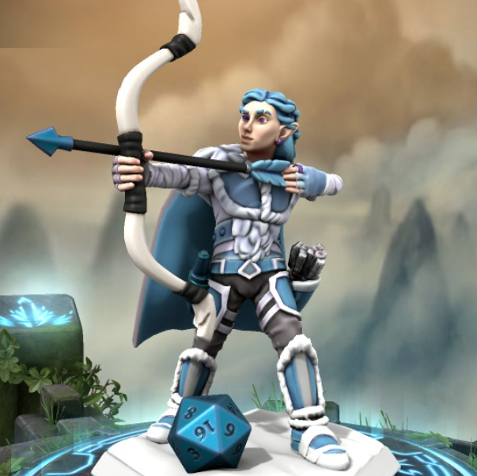
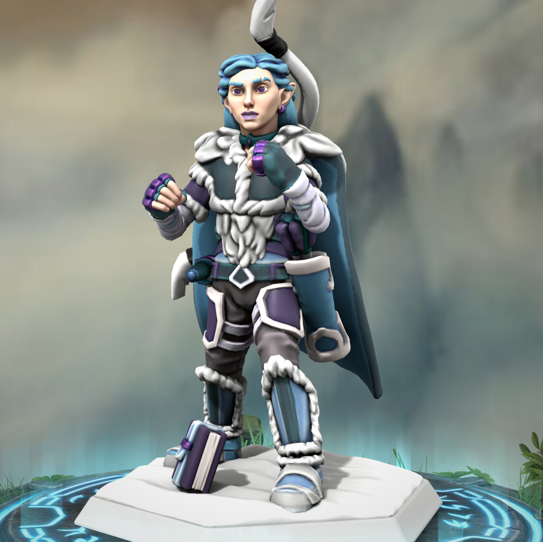

# Fionnlagh

  

| Player: | Els |
| :----- | :----- |
| Character Name | Fionnlagh |
| Character Info: | Male / Half-Elf / Monk |
| First Session: | [Session 001](./Session 001.md) |

### Current State
31 max HP + aid 5 (8hrs) = 36 > 33
Full KI Just had a full rest.

### Items
Clockwork amulet: 
Wondrous item, common

This copper amulet contains tiny interlocking gears and is powered by magic from Mechanus, a plane of clockwork predictability. A creature that puts an ear to the amulet can hear faint ticking and whirring noises coming from within.

When you make an attack roll while wearing the amulet, you can forgo rolling the d20 to get a 10 on the die. Once used, this property can't be used again until the next dawn.

## Salary
10 GP a day paid out in Emberholt.

### Background Story
As a newborn, I was left at the doorstep of a human monastery. I was wrapped in a purple blanket and there was no letter or other clue. I was raised as an acolyte in a monastery. I was the only child there and had to entertain myself in between prayer, lessons and meals. The monastery is dedicated to Selûne. I can find common ground between the fiercest enemies, empathizing with them and always working toward peace. Nothing can shake my optimistic attitude.

When I was a teenager I felt the fact that I was different, not quite human, but not Elven enough to run away to an Elven community. I was dedicated to my studies and prayers, until I heard two of the monks talk about the Dark Moon Heresy and was intrigued by how mysterious it sounded. I started sneaking around in the library looking for information about what this heresy entailed. I uncovered a tale about one deity with two aspects. I identified with the duality in the Goddess. In the years after my worship shifted to the Dual Goddess. I managed to keep it secret from the other monks, but when I turned 16 I decided to go into the world, so I could be free to express my true beliefs. I act as an intermediary between the realm of the holy and the mortal world, performing sacred rites and offering sacrifices in order to conduct worshipers into the presence of the divine. In the last two years I dedicated myself to both Selûne and Shar, as they are the same. I soon found out that it might be wise to keep this belief to myself however and often present myself as a believer in one of them.

When a new continent was discovered, many organizations sent explorers and treasure hunters to search for ways to exploit the new land. Very few returned, and those that did told horrifying tales of a terrifying landscape which guarded strange and magnificent treasures. They say the heart of the land is in its center, and there lies such amazing power that it would be the solution to all of the world’s problems. The new continent was unofficially called the Living Lands. Eventually, exploration became too costly and dangerous, and so most companies resigned. Only one organization, the Grand Venture Company, determinedly pushes on. They have established a few outposts in different regions around the Living Lands. They enlist daring adventurers, and encourage them to explore the land, and seek their fame and fortune in the name of the Grand Venture Co.

As you were travelling through your lands, enacting sacred rituals for the divided being of Selune and Shar, you came across a shrine to Selune. You knelt in prayer, and were struck with a sudden vision of cold, biting winds and a harsh, blizzarding storm. Amidst the blur of white, you heard the interlacing voices of Selune and Shar. “You who have learned our secret, follow the way to meet your kin. To the ends of the earth you must go. Through blistering winds and biting cold you will travel, beyond which, you will find the truth you seek.” Deciphering the words, you believe the message is directing you towards the Living Lands. You have heard of a company which has launched an expedition to this undiscovered land and established an outpost in the frigid arctic regions. You resolved to travel there, seeking an answer which will bring your soul peace.

