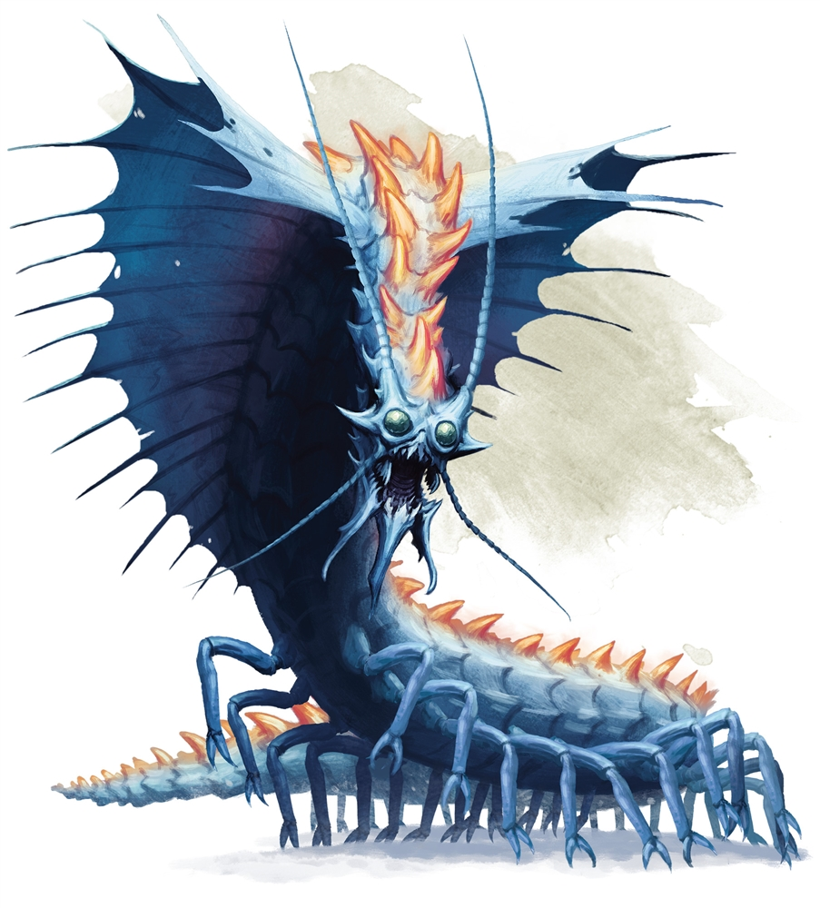

# Rhemorhaz

[D&D Beyond](https://www.dndbeyond.com/monsters/remorhaz)

They have a heatsac

Encountered in:
- [Session 001](./Session 001.md)
- [Session 002](./Session 002.md)
- [Session 003](./Session 003.md)
